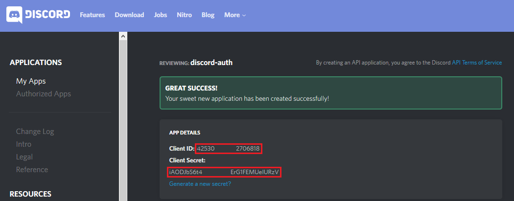
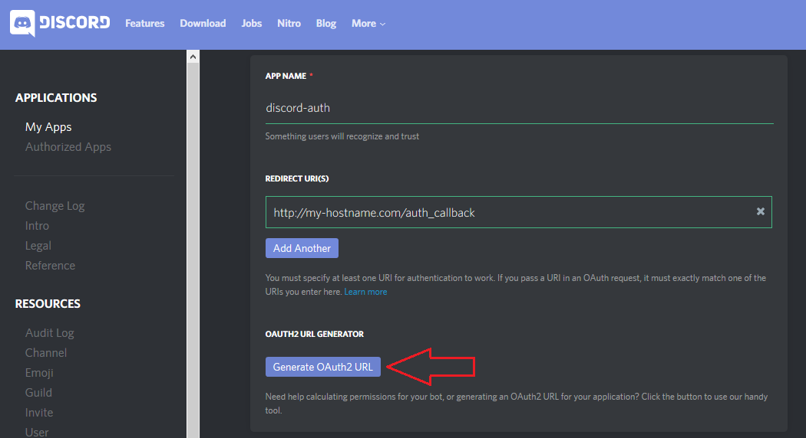
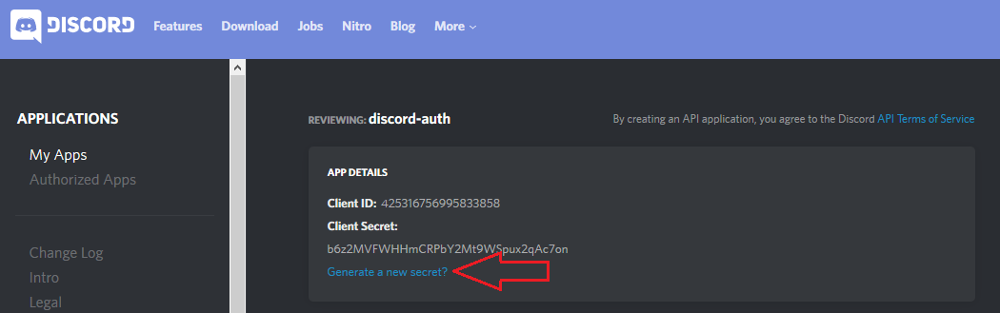
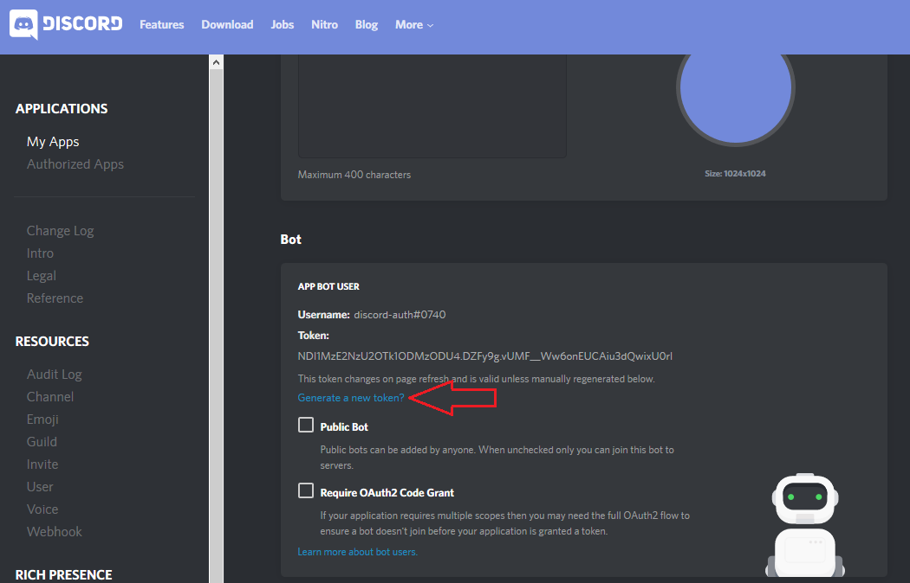

# Creating an application + bot in Discord

1. First you need to go to [here](https://discordapp.com/developers/applications/me) and click "**New Application**".

2. Now give your application a name.

3. Set your redirect URI to your externally visible hostname (`--external-hostname`), ending with `/auth_callback` - to make sure RocketMap receives the authentication codes.

4. Click "**Create Application**". Now you should take note of your API client credentials: "**Client ID**" and "**Client Secret**".

5. Scroll down the page until you see "**Create a Bot User**" and click that. Also click the confirmation alert "**Yes, do it!**".

6. Now you can get your bot's token by using the "**click to reveal**" button in the _App Bot User_ section.

7. You now have your bot access token! Now, to invite the bot to your server we need to generate an OAuth2 URL. Click the "**Generate OAuth2 URL**" button. Don't worry about the bot being up and running for this next step.

8. To generate the correct OAuth2 URL, make sure that "**bot**" in _Scopes_ section and "**Manage Roles**" in _Bot Permissions_ are checked. Now click "**Copy**" button to copy the generated URL to your clipboard.

9. Open a new tab in your browser, paste the URL you just got in the previous step and navigate to it. You will be presented to a page that looks like this:

10. Now select your server in the dropdown, then click "**Authorize**".

**That's it!** Now you can start your bot and enjoy chatting!

**IMPORTANT: you should NEVER give your bot's token to anybody you do not trust, and never EVER under any circumstances push it to a public Git repository where everyone can see it.** The token gives you full access to your bot account's permissions, so if somebody gains access to it maliciously they could do any number of bad things with the bot -- this includes leaving all of its guilds (servers), spamming unfavorable links or messages in text channels, deleting messages/channels in guilds where it has moderator permissions, and other nasty stuff along those lines. Keep it a secret! 
## Compromised client secret or bot token 
If your API client secret or bot token ever does get compromised, or you suspect it has been, the very first thing you should do is [go to its Discord Apps page](https://discordapp.com/developers/applications/me) and generate new ones.

- Client Secret: press "**click to reveal**" in the _App Details_ section, then click "**Generate a new secret?**" and "**Yes, do it!**" in the confirmation dialog. This will give you a unique, brand-new client secret you must use from now on.

- Bot Token: press "**click to reveal**" in the _App Bot User_ section, then click "**Generate a new token?**" and "**Yes, do it!**" in the confirmation dialog. This will give you a unique, brand-new token that you can update your bot's code with.

Afterwards, take the appropriate measures to place these new credentials in a secure place where it can't be leaked or compromised again.
